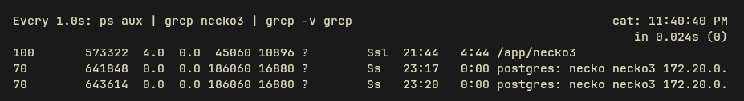

<div align="center">
  <a href="https://github.com/necko-moe/necko3-backend">
    
  </a>
  <h1>necko3-backend</h1>

  <a href="https://github.com/necko-moe/necko3-backend/stargazers">
    
  </a>
</div>

***

## About
**necko3-backend** is a module of the necko3 project, representing a high-performance **Axum** web server. It also serves as a reference implementation of `necko3-core`, demonstrating full integration.

<div align="center">
  
  <p>Thanks to the architecture and how Rust works in general, the backend in an active state <i>(listening to Polygon PoS, handling USDC, processing a trio of transactions simultaneously, and attempting to send webhooks to a closed server)</i> consumes an average of <b>11MB</b> (the binary itself). However, Postgres is gonna Postgres — it'll still eat RAM like a horse.</p>
</div>

### Features
- Always up-to-date Swagger UI, which can be disabled for production _(disabling it has zero impact on memory usage)_.
- Authorization via `X-API-Key` header.
- Public invoice endpoints not requiring an API key.
- Lightweight, incredibly fast, asynchronous architecture.
- Configurable log output format (compact/full or json for production).
- Production-ready `docker-compose.yml` with healthchecks included.

I also highly recommend checking out the key features of the `necko3-core` module, as this repo only touches the surface — the real magic happens there.

## Installing and Launching

⚠️ Before you start, choose your fighter: do you want to run everything in one go (backend + database), or keep them separate

### 1. Preparation
Copy the `docker-compose-____.yml` file you need and rename it to `docker-compose.yml`:

| File                         | Description                                                                                                                                   |
|------------------------------|-----------------------------------------------------------------------------------------------------------------------------------------------|
| `docker-compose-prod.yml`    | Usually what you need. All-in-one: Backend + Postgres.                                                                                        |
| `docker-compose-db.yml`      | Postgres only. **Important:** If you plan to host the DB on a separate server from the backend, change the bind from local address to public. |
| `docker-compose-backend.yml` | If you don't like the bare binary or just want to isolate the backend from society.                                                           |
| **NONE**                     | You can run the binary on bare metal if you already have a running database (or use mocks for testing).                                       |

```bash
# Install Docker if not already installed
sudo curl -fsSL https://get.docker.com | sh

# Create working directory
mkdir /opt/necko3 && cd /opt/necko3

# Replace "-prod" with the format you need (see table above)
curl -o docker-compose.yml https://raw.githubusercontent.com/necko-moe/necko3-backend/refs/heads/main/docker-compose-prod.yml
```

### 2. Configuration (.env)
First, copy the `.env` file:
```bash
curl -o .env https://raw.githubusercontent.com/necko-moe/necko3-backend/refs/heads/main/.env.example
```

Next, generate an `API_KEY` (non-negotiable, you need this) and a decent password for Postgres (if your DB is already set up, fill in the connection details yourself).
```bash
# Generate API_KEY
sed -i "s/^API_KEY=.*/API_KEY=$(tr -dc A-Za-z0-9 </dev/urandom | head -c 64; echo)/" .env

# Generate DATABASE_PASSWORD and update DATABASE_URL
pass=$(tr -dc A-Za-z0-9 </dev/urandom | head -c 24; echo) && \
  sed -i "s/^DATABASE_PASSWORD=.*/DATABASE_PASSWORD=$pass/" .env && \
  sed -i "s|^\(DATABASE_URL=postgres://[^:]*:\)[^\@]*\(@.*\)|\1$pass\2|" .env
```
Feel free to tweak other parameters in `.env`, but what you just did is vital for both operation and security.

### 3. Launch
#### Variant A: All-in-one docker-compose.yml (if you copied the -prod file)
```bash
cd /opt/necko3 # or wherever you shoved the docker-compose file

docker compose up -d && docker compose logs -f -t
```
The backend will be available on port `3000` (you can change `BIND_ADDRESS` in `.env` or the ports in `docker-compose.yml`).

#### Variant B: Backend separate from Database (if you copied the -db file)
```bash
cd /opt/necko3 # where the DB docker-compose.yml is located

# If the binary is on a separate server, change the bind ports so it listens on public IP, not local
nano docker-compose.yml
# services:
#   db:
#     (...)
#     ports:
#       - "5432:5432"

docker compose up -d && docker compose logs -f -t
```
_P.S. In the `.env` file, you can leave just DATABASE_USER, DATABASE_PASSWORD, and DATABASE_DB._

Next, download the binary from Releases for your architecture, place it next to the `.env` file (or create a new one with DB connection details), and run it.

```bash
mkdir /opt/necko3 && cd /opt/necko3

# Replace x86_64 with aarch64 if you are on ARM64
wget -o necko3 https://github.com/necko-moe/necko3-backend/releases/latest/download/necko3-linux-x86_64

# Create a separate tmux session so the binary keeps spinning regardless of your SSH connection
# https://tmuxcheatsheet.com/ 
tmux new-session -A -s necko3

chmod +x necko3 && ./necko3
```

If there are no errors, congratulations — the backend is available at `BIND_ADDRESS` (check `.env`).

#### Variant C: Backend container with existing Database (if you copied the -backend file)

```bash
cd /opt/necko3 # where the docker-compose.yml is located

docker compose up -d && docker compose logs -f -t
```

The backend will be available on port `3000` (you can change `BIND_ADDRESS` in `.env` or the ports in `docker-compose.yml`).

#### Variant D: Bare Metal (No Docker Daddy)
```bash
mkdir /opt/necko3 && cd /opt/necko3

# Replace x86_64 with aarch64 if you are on ARM64
wget -o necko3 https://github.com/necko-moe/necko3-backend/releases/latest/download/necko3-linux-x86_64

# Create a separate tmux session so the binary keeps spinning regardless of your SSH connection
# https://tmuxcheatsheet.com/ 
tmux new-session -A -s necko3

chmod +x necko3 && ./necko3
```

The backend will be available on port `3000` (you can change `BIND_ADDRESS` in `.env`).

## Contributing

I'd be happy to see any feedback.<br />
Found a bug? <a href=https://github.com/necko-moe/necko3-backend/issues/new>Open an Issue</a>.<br />
Want to add a feature? Fork it and send a PR.

## License

The project and all repositories are distributed under the **MIT License**. Feel free to use, modify, and distribute <3

* * *

<div align="center">
  <h1>SUPPORT PROJECT</h1>
  <p>Want to make necko1 employed or donate enough for a Triple Whopper? Contact me -> <a href=https://t.me/everyonehio>Telegram</a> or <a href="mailto:meow@necko.moe">Mail me</a> (I rarely check that). I don't accept direct card transfers, just so you know</p>
  <p>
    Broke but still want to help?
    You can just <a href="https://github.com/necko-moe/necko3-backend/stargazers"><b>⭐ Star this repo</b></a> to show your love. It really helps!
  </p>
  <a href="https://github.com/necko-moe">
    
  </a>
</div>
